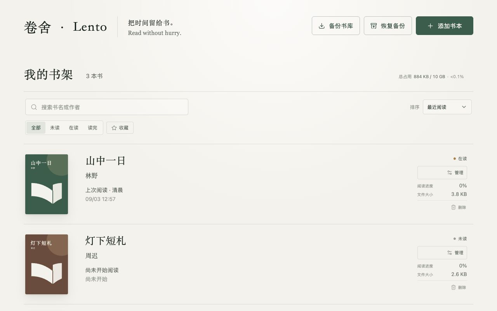
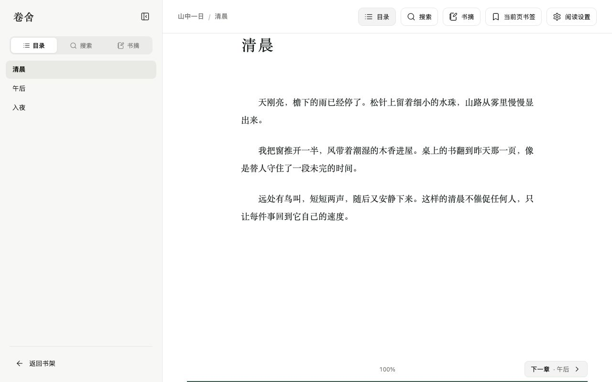

  

<h1 align="center">卷舍 · Lento</h1>

  <strong>一个安静、私密的浏览器 EPUB 阅读器。</strong> 
  把时间留给书。Read without hurry.

  <a href="README.md">English</a> ·
  <a href="README.zh-CN.md">简体中文</a> ·
  <a href="PRIVACY.md">隐私政策</a> ·
  <a href="https://github.com/yuzhouu/lento-epub/issues">反馈</a>

卷舍把 EPUB 书架与阅读空间收在一个安静、简洁的地方。导入自己的书，按习惯整理，并从上次停下的位置继续阅读——不需要注册账户，也不会把你的阅读生活发送到服务器。

## 好好整理自己的书

- 选择或拖放多个 EPUB，一次加入书架
- 直接读取书中的标题、作者与封面
- 按书名或作者搜索，并按最近阅读、添加时间或阅读进度排序
- 用未读、在读、读完状态，以及收藏和自定义标签整理书架
- 根据内容识别重复书籍，避免书架越用越乱

## 阅读空间，顺着你的习惯

在章节滚动、连续滚动与传统分页之间自由切换。细调字体、字号、行距、版心宽度、段落样式和纸张主题，让页面读起来刚刚好。目录、全文搜索与阅读进度随手可用，却不会挤占正文。

界面适配桌面与移动宽度，并提供简体中文、英文、日文、俄文、法文和西班牙文。

## 留下真正重要的内容

为当前页添加书签，或选中文字保存彩色划线与批注。所有阅读记录都能按书集中查看，也可以随时导出为 Markdown 或纯文本，带到其他地方继续使用。

## 本地优先，是基本设计

EPUB 文件、阅读位置、进度、书签、划线、批注与偏好都留在当前浏览器。卷舍没有账户、广告或行为分析，也不会上传你的书籍和阅读记录。

更换浏览器或设备时，可以导出包含书籍与阅读数据的 `.lento` 备份。在新书架恢复前，卷舍会展示冲突，让你逐本选择覆盖、保留两本或跳过。

## 用适合自己的方式打开

卷舍提供独立网站、可安装且支持离线应用外壳的 PWA，以及 Chrome 扩展。每个安装环境都有彼此独立的本地书架，只有在你主动导出并恢复备份时，数据才会移动。
